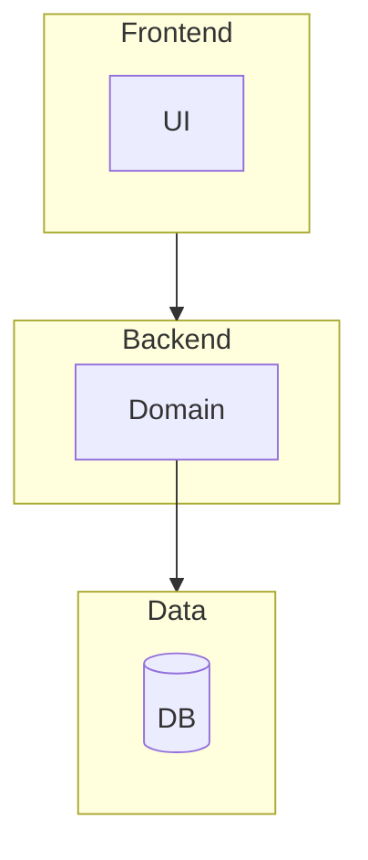

# Initial dev info

<!-- TODO: Mark this page as complete whenever the first version will be hosted online -->

## Description

Static web site showcasing info about me as a professional and my thoughts in
the form of articles.

## Technical Requirements

0. Main page with major navigation and short info about me:
    - greeting view with image and short info
    - latest articles with navigation to the full list
    - simple header navigation to: feed, about me
1. Feed with all articles:
    - searching by name and content, tag
    - filtering by: tags
    - sorting by: date
2. Article page:
    - title
    - content: text, links, images, code
    - tags
3. About me
    - avatar
    - info
    - CV link
    - contacts
4. Performance has to be super fluent
5. Fonts, images and everything has to be super personal to showcase who I am
6. It has to be an easy task to post an article or change info about me:
    - ADMIN can add new data
    - USER can only read data

## Restrictions

1. Safe to publish
2. No super personal info (no possibility to find my family or friends)
3. host itself has to be independent of my personal tools and data

## Architecture Design

Layer Architecture:

